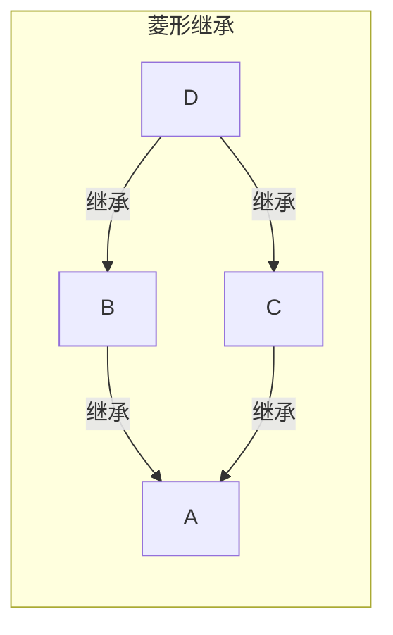

### 封装

#### 访问限制

- Python 对属性权限的控制是通过属性名来实现的，如果一个属性由双下划线开头 ==`__`==，该属性就无法被外部访问。
- 但是，如果一个属性以 `__xxx__` 的形式定义，那它又可以被外部访问了，以 `__xxx__` 定义的属性在 Python 的类中被称为特殊属性，并且通常我们不应该把普通属性用 `__xxx__` 定义。
- 以单下划线 ==`_`== 开头的属性 `_xxx` 虽然也可以被外部访问，但是按照约定，他们不应该被外部访问。另外该属性不能被子类继承，也不会被 `from module import *` 导入

  > 关于 Python 中下划线用法的总结可参考  
  > https://dbader.org/blog/meaning-of-underscores-in-python

### 继承

#### 定义新的 Student 类继承已定义的 Person 类

- 一定要用 `super(Student, self).__init__(name, gender)` 去初始化父类，否则，继承自 `Person` 的 `Student` 将没有 `name` 和 `gender`
- 函数 `super(Student, self)` 将返回当前类继承的父类，即 `Person`，然后调用 `__init__()` 方法，注意 `self` 参数已在 `super()`中 传入，在 `__init__()` 中将隐式传递，不需要写出（也不能写）
- 初始化父类的属性后，只需要再把子类额外的属性加上

```python
# Person 类
class Person:
    def __init__(self, name, gender):
        self.name = name
        self.gender = gender

# 继承 Person 的 Student 类
class Student(Person):
    def __init__(self, name, gender, score):
        super(Student, self).__init__(name, gender)
        self.score = score
```

#### 多重继承

- D 同时继承自 B 和 C，也就是 D 拥有了 A、B、C 的全部功能。多重继承通过 `super()` 调用 `__init__()` 方法时，A 虽然被继承了两次，但 `__init__()` 只调用一次。
- 多重继承的目的是从两种继承树中分别选择并继承出子类，以便组合功能使用。



```python
class A:
    def __init__(self, a):
        print("init A...")
        self.a = a
        print("end A...")

class B(A):
    def __init__(self, a):
        print("init B...")
        super(B, self).__init__(a)
        print("end B...")

class C(A):
    def __init__(self, a):
        print("init C...")
        super(C, self).__init__(a)
        print("end C...")

class D(B, C):
    def __init__(self, a):
        print("init D...")
        super(D, self).__init__(a)
        print("end D...")

d = D(1)

# 调用结果
init D...
init B...
init C...
init A...
end A...
end C...
end B...
end D...
```

可以看出 Python 中从 Object 继承来的类，会采用**广度优先**搜索的方式来进行继承。

### 多态

> 同一类事物在运行过程中表现出不同的状态

多态的两个条件：

- 继承
- 重写

Python 作为一种动态语言，崇尚鸭子类型[鸭子类型](https://baike.baidu.com/item/鸭子类型)，参数在传入之前无法确定也不需要声明参数类型，可以像多态一样工作但无需继承，并支持实现多态性。
