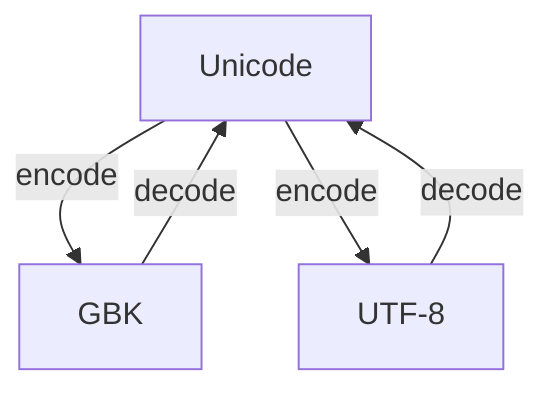
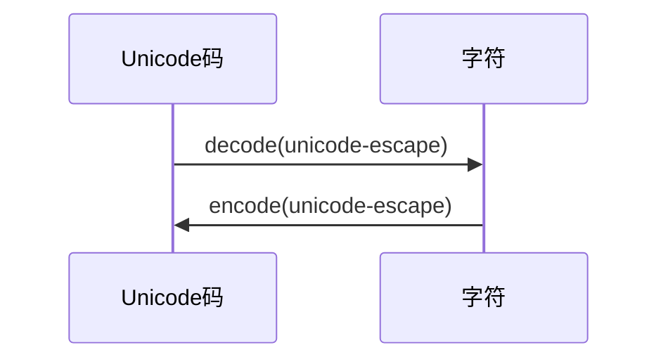

> 程序员如果不弄懂字符编码它就会像幽灵一般纠缠你整个职业生涯，各种灵异事件会接踵而来，挥之不去。  
> --- 刘志军 [知乎]

```text
1 bit  = 2 种两种可能性（0或1）
1 byte = 1 字节 = 8 bit = 2 ^ 8 次方 = 256 种可能性
```

## 字符编码简介

在计算机中，所有的数据在存储和运算时都要使用二进制数表示（因为计算机用高电平和低电平分别表示 1 和 0），而具体用哪些二进制数字表示哪个符号，当然每个人都可以约定自己的一套（这就叫编码规则）。

### ASCII

ASCII（American Standard Code for Information Interchange，美国信息交换标准代码）</br>
是一种**单字节**的编码方案，指定的 7 位或 8 位二进制数组合来表示 128 或 256 种可能的字符，主要用于显示现代英语。

### MBCS

MBCS（Muilti-Bytes Charecter Set，多字节字符集）</br>
使用**两个字节**来代表一个字符的各种汉字延伸编码方式，又称为 ANSI 编码。</br>
在简体中文系统下，ANSI 编码代表 `GB2312` 编码；日文操作系统下，ANSI 编码代表 `Shift_JIS` 编码；韩文操作系统下，ANSI 编码代表 `Euc-kr` 编码。</br>
不统一的编码标准会不可避免地出现冲突。

### GBK 和 gb2312

见上

### UCS

Universal Character Set, UCS（中文：通用字符集）是由 ISO 制定的 ISO 10646（或称 ISO/IEC 10646）标准所定义的标准字符集。</br>
UCS-2：使用两个定长的字节来表示一个字符。</br>
UCS-4：是一个更大的尚未填充完全的 31 位字符集，加上恒为 0 的首位，共需占据 32 位，即**四字节**。理论上最多能表示 231 个字符，完全可以涵盖一切语言所用的符号。

### Unicode

Unicode（中文：万国码、国际码、统一码、单一码）是计算机科学领域里的一项业界标准，包括字符集、编码方案等。</br>
Unicode 伴随着 UCS 的标准而发展，至今仍在不断增修，每个新版本都加入更多新的字符。</br>
当前实际应用的 Unicode 版本对应于 UCS-2，每个字符占用**两个字节**。</br>
由于计算机的内存比较大，并且字符串在内容中表示时也不会特别大，所以在**计算机内存**中使用 Unicode 来处理字符。

### UTF-8

UTF-8（8-bit Unicode Transformation Format）是一种针对 Unicode 字符集 的可变长度字符编码规则。</br>
UTF-8 使用**一至四个字节**为每个字符编码，可以用来表示 Unicode 标准中的任何字符。</br>
UTF-8 的特点是对不同范围的字符使用不同长度的编码。对于 0x00-0x7F 之间的字符，UTF-8 编码与 ASCII 编码完全相同，因此可以说 ASCII 是 UTF-8 的子集。

### UTF-16 和 UTF-32

### Unicode 和 UTF-8 的区别

UTF，是为 Unicode 字符集设计的一种在**存储和传输**时节省空间的实现方式。</br>
简单来说：Unicode 是「字符集」，UTF-8 是「编码规则」。</br>
从通信角度的理论来说：unicode 是信源编码，对字符集数字化；UTF-8 是信道编码，为更好的存储和传输。

| Unicode 编码(十六进制) | UTF-8 字节流(二进制)                                  |
| ---------------------- | ----------------------------------------------------- |
| 00000000 - 0000007F    | 0xxxxxxx                                              |
| 00000080 - 000007FF    | 110xxxxx 10xxxxxx                                     |
| 00000800 - 0000FFFF    | 1110xxxx 10xxxxxx 10xxxxxx                            |
| 00010000 - 001FFFFF    | 1110xxxx 10xxxxxx 10xxxxxx 10xxxxxx                   |
| 00200000 - 03FFFFFF    | 1110xxxx 10xxxxxx 10xxxxxx 10xxxxxx 10xxxxxx          |
| 04000000 - 7FFFFFFF    | 1110xxxx 10xxxxxx 10xxxxxx 10xxxxxx 10xxxxxx 10xxxxxx |

## Python 中字符编码问题

在 Python 中，解释器会在解释执行代码前，先将代码通过系统默认编码方式读入系统内存，再由编译器以特定编码格式编码交付虚拟机解释执行。</br>
即在 Python 2.x 中，解释器默认会将代码以 ASCII 编码方式读入系统内存，但编译器却不会在内存中将代码自动转换为 Unicode；</br>
而在 Python 3.x 中，解释器默认会将代码以 UTF-8 编码方式读入系统内存，并且编译器会在内存中将代码自动转换为 Unicode。

### Python 查看系统默认编码格式问题

在 Python2.x 的版本中，系统默认编码格式为 `ascii`，我们可以通过以下代码查看 Python 的系统默认编码：

```python
>>> import sys
>>> sys.getdefaultencoding()
'ascii'
```

### Python2.x 文件头部设置编码格式

当我们在 Python2.x 文件的开头加上 `# -*- coding: gbk -*-` 或 `# encoding=utf-8` 时，会告诉 Python 解释器读取该文件时的编码方式是 `utf-8`，这时，Python 解释器便会将代码通过 UTF-8 的方式读入系统内存，同时编译器也只会把代码以 UTF-8 的编码格式交付虚拟机解释执行。

### Python2.7 编码处理

- 将 unicode 输出成中文：
  ```python
  >>> unic ='\u4f60\u597d'
  >>> print(unic.decode('unicode-escape'))
  你好
  ```

### Python3.x 编码处理

- 将 unicode 输出成中文：
  ```python
  >>> unic
  ```

### 图解





> **参考**：  
> https://zh.wikipedia.org/wiki/Unicode  
> https://foofish.net/unicode_utf-8.html  
> https://www.zhihu.com/question/31833164/answer/381137073
