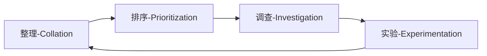
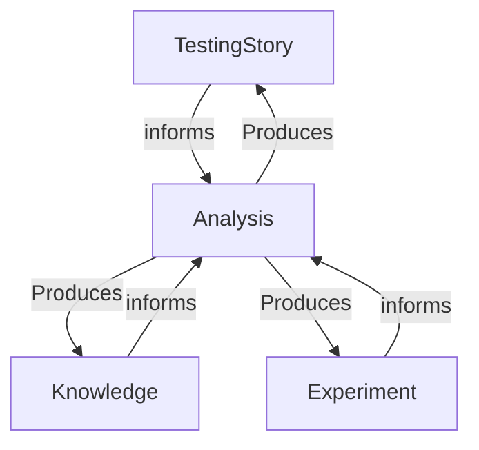
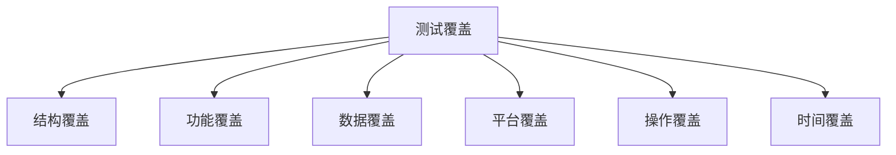
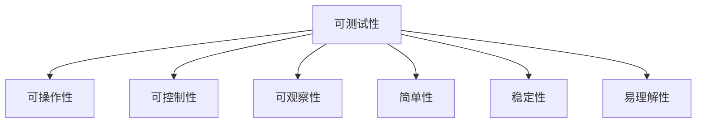

> _每一个好的缺陷背后，都可能藏着一个更好的缺陷，在你确实了解缺陷的影响程度和破坏力之前永远不要停止探索。_

## 探索式测试的定义

探索式测试（Exploratory Testing）是一种自由的软件测试风格，强调测试人员同时开展测试学习，测试设计，测试执行和测试结果评估等活动，以持续优化测试工作。 
关键词：即兴发挥 快速实验 动态调整

### 探索式测试的目标

1. 理解应用程序如何工作，他的接口看起来怎样，实现了什么功能
2. 强迫软件展示其全部能力
3. 找到缺陷

### 探索式测试的起源和发展

- 1983 年 Cem Kaner 博士提出，并受到语境驱动测试学派支持。
- James A. Whittaker 提出漫游测试
- Jonathan & James Bach 提出基于测程的测试管理

### 语境驱动测试 7 原则

1. 任何实践的价值都取决于其语境
2. 在特定语境下存在好的实践，但不存在最佳实践
3. 人，在一起工作的人，是项目语境中最重要的部分
4. 项目的发展往往难以预料
5. 产品是一种解决方案，如果问题没有解决，它就是无用的
6. 好的软件测试是一个具有挑战性的智力过程
7. 只有通过判断和技能，并在整个项目过程中协同练习它们，我们才能在正确的时间做正确的事，以有效地测试我们的产品

### 如何培养高素质的测试人员

Cem Kaner 指出：“测试过程的一个重要的成果是更好、更聪明的测试人员。” 
优秀的测试人员具备高超的技能，而这种技能只能通过持续的学习和实践才能获得。而且在一个合作与分享的环境中，测试人员可以学的更快、练得更好。

### 探索式测试的思维模型-CPIE (Erik Petersen)

- 整理：尽最大可能收集关于被测产品的信息，去了解和理解它们。
- 排序：确定所有测试任务的优先级。
- 调查：对即将执行的测试任务进行仔细的分析并确定测试输入和预期输出。
- 实验：实际地去测试，验证我们的预测是否正确，检查我们在整理阶段获取到的信息是否正确。根据实验结果，测试人员将收集更多的信息，并调整测试任务的优先级。

### 探索式测试的思维过程 (James Bach)

- 知识：掌握产品特性、开发技术、测试技术和领域规则等测试需要的知识。
- 分析：分析产品风险、测试覆盖、测试方法、测试先知和产品缺陷等测试相关因素。
- 实验：配置、操作、观察和评估被测产品。
- 测试故事：用测试计划、测试报告、和可工作的产品等组成测试结果，以准确地反应测试状态和产品质量。

### 参考 HICCUPPS 启发式规则构造测试先知

- 历史(History)：目前所做的产品的版本是否与过去的版本相一致。
- 愿景(Image)：产品是否与开发组织的愿景相一致。
- 相似产品(Comparable Products)：产品是否与类似的产品相一致。
- 声明(Claims）：产品是否与重要人物的声明相一致。
- 用户期望(User's Expectations)：产品是否与用户期望相一致。
- 产品自身(Product)：产品中可比较的各个功能是否一致。
- 目的(Purpose)：产品是否与其（明确的或隐含的）目的相一致。
- 法规(Statutes)：产品是否与适用的法律相一致。
- 常识(Familiarity)：产品是否与常识相一致。

### 构造测试先知时可能会遇到的问题

- 没有测试先知可以使测试人员提前确定所观察到的系统行为必定是正确或错误的。
- 没有一个单独的测试先知可以说明某个功能在任何时间或任何情况下都是正确工作的。
- 有些功能看上去是正常工作的，但在某些情况下会失败，且会影响其他测试先知的正确性和适用性。

### 处理上述问题时可作为参考的思路

- 忽略这个问题（也许这个信息的价值从成本角度考虑不值得）。
- 简单化这个问题（改善可测试性以获得更多的信息、分析需求、规约和代码，从而获得更简单的检查规则）。
- 转移这个问题（考虑问题的相关性，从类似问题下手）。

### 测试设计阶段使用启发式方法来产生更多更好的测试思路

启发式方法是一种经验方法，它针对复杂的问题提出一种简单的、较可能成功的解决思路。

- **引导词启发法：** 一些词语或标签能引导测试人员发掘自身的知识和经验，产生新的测试思路。
- **触发器启发法：** 一些存在于事件或条件中的想法，能提醒测试人员采用另外一种方式来进行试验，产生新的思路。
- **副标题启发法：** 能帮助测试人员重构测试想法并获得更多的选择点。
- **启发式模型：** 一组系统性的想法能帮助测试人员控制、管理和挖掘更多的想法。

### 测试是测试人员尝试去操作被测系统并且查看被测系统是否正常工作的过程

### 启发式测试策略模型 HTSM (James Bach)

HTSM 是一个结构化的、可定制的参考模型，它由一组层次化的指导词组成，从质量标准、项目环境、产品元素到测试技术等多个角度启发测试设计，来帮助发现产品风险。

### 产品功能测试的三个层次

- 单个特性测试
- 交互特性测试
- 系统交互测试

## 探索式测试的方法论

### 单个特性测试-漫游测试模型

基础方法

- **卖点测试法：**
  此方法鼓励测试人员观看销售部门给客户演示的 Demo，理解从销售的角度来看哪些功能对客户来说是最大的卖点，他们未必就是核心功能，但值得测试人员把它们当核心功能来对待。同时，也许刁钻的客户会提出各种质疑，这些质疑和稀奇古怪的问题也可以纳入测试人员的设计中。
- **恶邻测试法：**
  测试人员找到那些缺陷数目较多的功能特性，并邻近的功能特性进行重点测试。
- **配角测试法：**
  测试人员找到那些紧邻主要功能的特性，从而对这些特性进行额外的测试和关注。
- **超模测试法：**
  针对 UI 的表面测试，衡量软件的展现能力，像 T 型台的超模那样，不去关注她们幕后的辛酸痛苦劳累，跳出产品专家或测试的头衔，以普通观众的角度，去关注那些能看到的界面展现，元素是否被正确绘制、是否难看、颜色风格是否一致、界面的切换变化是否表意清晰？
- **懒汉测试法：**
  选择尽可能少的输入，能不输入尽量不输入，能不修改尽量不修改，观察应用程序是否能响应得出正确结果。
- **反叛测试法：**
  你见过去酒吧不喝酒点果汁的么？反叛思想要求输入最不可能的数据，或者已知的而已输入，测试人员可以采用逆向思维、明知一些数据违反规则，却偏偏要采用这样的数据，或者不按照正确的顺序来输入。
- **强迫症测试法：**
  测试人员强迫软件一边又一边接受同样的数据，反复执行同样的操作，最重要的特点就是重复。此种思维方式，常常打破了开发人员设计代码的思路，他们预想着你会按步骤操作，却不曾考虑过你反复的执行第一步应该如何处理。

进阶方法

- **极限测试法：**
  向软件提出难以回答的问题，比如最大可以发挥到什么程度，承受多少用户，承载多少数据。哪些特性或功能会把软件逼到极限运作，哪些输入和数据会消耗软件最多的计算能力？哪些输入可能绕过它的错误检测？
- **麻烦测试法：**
  测试人员对于某个特性故意设置各种障碍来看产品如何应对，思路就是采用一些非正常的使用方式。
- **通宵测试法：**
  繁华的都市总会有通宵热闹的地方，比如夜总会 KTV 之类的，它们从不中断。那么应用程序是否也能坚持到最后呢？当它面临持续不断的调用、输入、重读重写之类的操作，如果运行时间足够长，就很可能会出问题，内存会需要回收、数据需要清空，永远不要关闭它，保持不间断的运行。（更多的时候会采用自动化或者机器人思想）
- **买一送一测试法：**
  测试人员同时运行同一个应用程序的多个实例，多个用户同时使用同一个特性，类似于多线程测试模型。
- **取消测试法：**
  此方法的思想是启动了立即停止，特别是一些运行流程比较耗时的功能如备份还原或者搜索，在启动之后，立即取消。发散一点还可以变成，启动一个耗时操作，不停止立即启动另外一个耗时操作，以此来检测应用程序的自我清除能力。
- **破坏测试法：**
  测试人员试图利用每个可能的机会暗中破坏产品，人为地创建恶劣的运行环境（内存少、无权限、断网、故障注入等）。

### 交互特性测试-场景操作模型

- **插入步骤-增加更多的数据**
- **插入步骤-使用附加输入**
- **插入步骤-访问新的界面**
- **删除步骤-删除部分步骤**
- **替换步骤-替换部分步骤**
- **重复步骤-重复部分步骤**
- **替换数据-替换部分数据**
- **替换环境-替换硬件**
- **替换环境-替换容器**
- **替换环境-修改本地配置**

### 交互特性测试-漫游探索模型

- **地标测试法：**
  在旅游的时候，如果我们设计了要到访的地方，通常会在地图上插上旗子，这就是地标。但是没有人规定我们应该按照何种顺序去到访这些地标。不同的测试人员可能会选择不同的顺序，有经验的测试人员会基于对软件产品架构和技术层面的理解，采取一些古怪的路径但更可能发现缺陷。
- **快递测试法：**
  快递运送的货物，就好比软件里的数据，经过不同地点的转接，拆包装包最终到底目的地。所以快递测试专注的是数据，跟随它们走遍整个软件。
- **遍历测试法：**
  测试人员按顺序罗列出非常相似的功能特性，再对这些功能的相似程度进行分类，然后进行顺序访问。
- **博物馆测试法：**
  这是针对软件的陈旧代码和历史缺陷进行的测试，历史总是应该被铭记的。历史遗留的代码，当初开发它们的时候，可能缺乏文档，但这并不意味着它们应该被忽略，而那些曾经出现过的 BUG，更是值得我们反复观察它。
- **上一版测试法：**
  测试人员找到先前版本支持的所有场景和用例，使用新版本的最新需求和数据进行测试。
- **深巷测试法：**
  在每个城市，都有些地方并不吸引游客意味着不吸引人群，但作为测试人员来说，反而是这种最不可能被用到或者最不吸引用户的特性，容易潜藏着难以发现的 Bug。
- **长路径测试法：**
  把那个在应用程序埋藏最深的界面当做测试目标（离起始点最远的那个界面），观察经过的每一个界面。

### 系统交互测试-漫游地图模型

- **商业区**
- **娱乐区**
- **历史区**
- **旅游区**
- **旅馆区**
- **破旧区**

### 系统交互测试-肥皂剧测试模型

### 系统交互测试-其它

- **指南测试法：**
  城市的地图通常都会标注一些热门的旅游景点，测试这些热门的区域是非常重要的。不管在任何一次发布的过程中，核心功能是肯定要覆盖到的。指南测试要求测试人员严格按照用户手册的建议执行操作，找出那些手册描述不到位或者核心功能并不像宣传的那样好的地方。
- **深夜测试法：** 城市灯火阑珊会在午夜过后逐渐安静下来，商场店铺纷纷打烊。但是软件不应该停止工作，软件测试人员有时应该刻意的关注在冷门时间段软件所做的附属工作，比如数据备份归档、维护监控任务的运行等等。
- **穿越测试法：** 有一些软件，它们一旦安装，就需要在很长一段时间内都可以正常去使用它，因此，测试人员有必要去观察在未来的时间里，这些软件是否仍可以正常工作。穿越测试法需要测试人员手动修改系统时间，穿越到过去或未来，查看软件在异常的时间段中表现是否在可控范围内。

## 探索式测试的组织与实施

### 协作性探索式测试

- **缺陷大扫除 (Bug Bash)**
- **结对测试 (Pair Testing)**
- **全民分享 (All Sharing)**

> 复制来源  
> 《探索式测试实践之路》 --史亮，高翔
